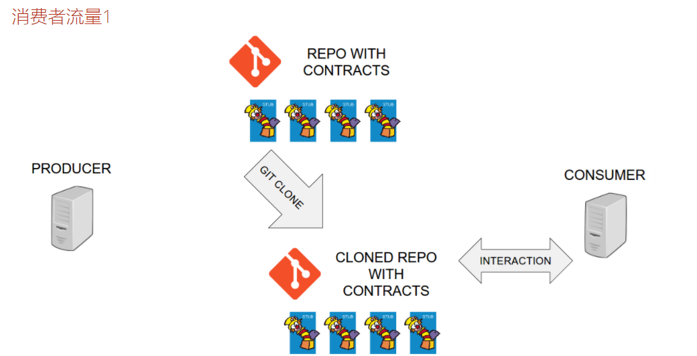
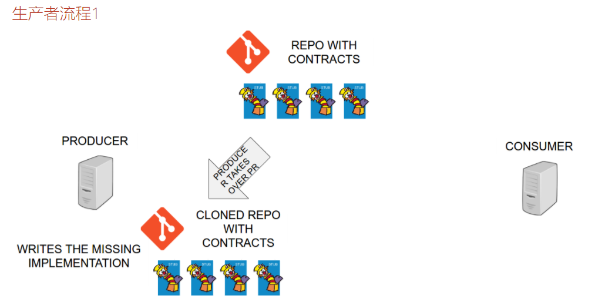
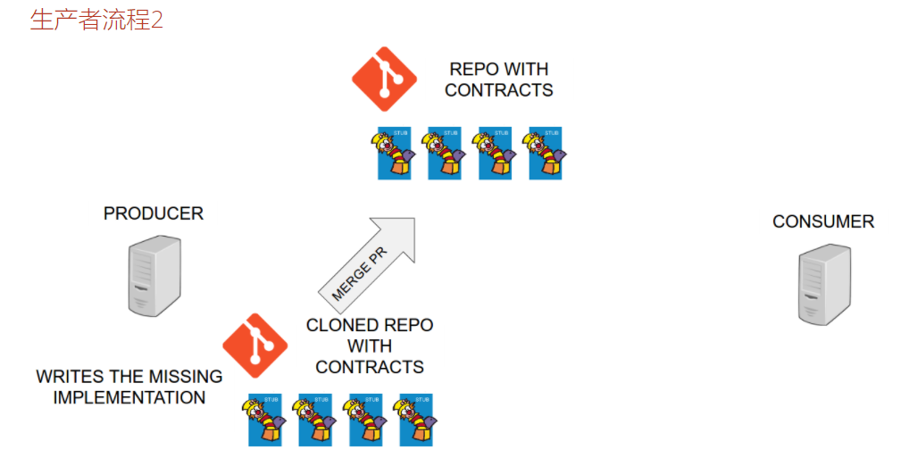
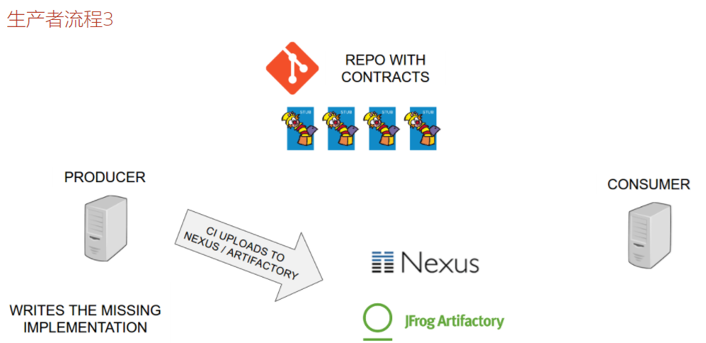
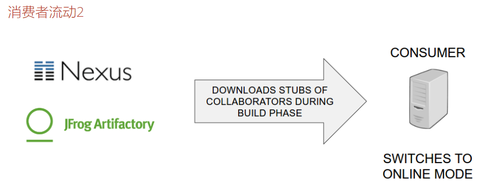

### 外部存储库中的契约
- HTTP＆Messaging的简单DSL示例
- 通过映射选择的基类
- 从契约生成文档

###使用消费者驱动的合同就像在架构级使用TDD。我们先来看看消费者的一个测试。


### 在本教程中，我们不会用契约克隆回购。我们将在IDE中打开它。存储库 beer_contracts(只有存根),将契约保存在单独的存储库中

### 添加依赖
````
<dependency>
    <groupId>org.springframework.cloud</groupId>
    <artifactId>spring-cloud-starter-contract-verifier</artifactId>
</dependency>
````

### 创建适当的文件夹结构

````
$ cd beer_contracts
$ mkdir -p src/main/resources/contracts/com/example/beer-api-producer-external/beer-api-consumer/messaging
$ mkdir -p src/main/resources/contracts/com/example/beer-api-producer-external/beer-api-consumer/rest
````

- 在上面的目录中使用Groovy DSL定义契约 http 和mq message

### 应该如何看待 beer_contracts/example/pom.xml
- 此配置文件：
    - 将jar名称设置为beer-api-producer-external（这是生产者的调用方式）。
    - 禁用测试生成（我们只想生成存根）。
    - 添加Spring Cloud Contract插件（可以看出，没有与基类相关的配置）。
    - 集合excludeBuildFolders，这是非常描述性的。生成存根 target和build生成文件夹时，我们不希望在输出jar中。
    - 集合contractsDirectory。默认情况下，Spring Cloud Contract在src/test/resources/contracts文件夹下搜索 。  
      在这种情况下，我们有合同/ （从pom.xml文件的角度来看）。  
        
现在，作为消费者，我们希望将契约转换为存根，以便我们可以使用API​​。我们使用Maven来实现。  
mvn clean install  

>你可以查看 target/stubs/META-INF/com.example/beer-api-producer/0.0.1-SNAPSHOT文件夹。   
在那里，您将看到contracts复制所有合同的mappings 文件夹，以及可以找到所有生成的存根的文件夹。   
默认情况下，Spring Cloud Contract使用WireMock作为假HTTP服务器的实现。在 beer/rest子文件夹下，   
您可以看到所有生成的存根。请注意，我们使用JSON路径来检查请求的内容。


###在HTTP消费者测试中打开Stub Runner   beer-api-consumer
- 添加依赖
````xml
<dependency>
	<groupId>org.springframework.cloud</groupId>
	<artifactId>spring-cloud-starter-contract-stub-runner</artifactId>
	<scope>test</scope>
</dependency>
````

### 测试 ExternalBeerControllerTest 和 ExternalBeerVerificationListenerTest

### 您成功地将生产者的API用于HTTP和消息传递。现在，您可以向存储所有合同的存储库提交拉取请求（PR）。




### producer_with_external_contracts在IDE中打开项目

## 总结
Spring Cloud contract 的核心思想是存根和契约有效性。现在，您已经定义了一组契约，但还没有对生产者端进行测试


### 为了使生产者使用契约，我们需要产生一个具有所有契约的JAR,在存储契约jar 中添加插件
````xml
<plugin>
  <groupId>org.apache.maven.plugins</groupId>
  <artifactId>maven-assembly-plugin</artifactId>
  <executions>
      <execution>
          <id>contracts</id>
          <phase>prepare-package</phase>
          <goals>
              <goal>single</goal>
          </goals>
          <configuration>
              <attach>true</attach>
              <descriptor>${basedir}/src/assembly/contracts.xml</descriptor>
              <appendAssemblyId>false</appendAssemblyId>
          </configuration>
      </execution>
  </executions>
</plugin>
````

### 在生产端 添加依赖
````xml
        <dependency>
			<groupId>org.springframework.cloud</groupId>
			<artifactId>spring-cloud-starter-contract-verifier</artifactId>
			<scope>test</scope>
		</dependency>
````

````xml
            <plugin>
                <groupId>org.springframework.cloud</groupId>
                <artifactId>spring-cloud-contract-maven-plugin</artifactId>
                <version>${spring-cloud-contract.version}</version>
                <extensions>true</extensions>
                <configuration>
                    <baseClassMappings>
                        <baseClassMapping>
                            <!--mq 契约包 匹配-->
                            <contractPackageRegex>.*messaging.*</contractPackageRegex>
                            <baseClassFQN>com.example.BeerMessagingBase</baseClassFQN>
                        </baseClassMapping>

                        <!-- http 契约包 匹配-->
                        <baseClassMapping>
                            <contractPackageRegex>.*rest.*</contractPackageRegex>
                            <baseClassFQN>com.example.BeerRestBase</baseClassFQN>
                        </baseClassMapping>
                    </baseClassMappings>
                    
                    <!--外部存储：契约 jar 包-->
                    <contractDependency>
                        <groupId>com.example</groupId>
                        <artifactId>beer-contracts</artifactId>
                    </contractDependency>
                    <!-- 从本地maven local 获取 -->
                    <contractsWorkOffline>true</contractsWorkOffline>

                    <!--基本包生成的测试 -->
                    <basePackageForTests>com.example</basePackageForTests>
                </configuration>

                <!--这是仅用于测试目的 -->
                <dependencies>
                    <dependency>
                        <groupId>org.springframework.cloud</groupId>
                        <artifactId>spring-cloud-contract-verifier</artifactId>
                        <version>${spring-cloud-contract.version}</version>
                    </dependency>
                </dependencies>
            </plugin>

````

>在这两种情况下，我们定义我们想要下载带有给定坐标的JAR(com .example:beer -契约)。  
 我们不提供contractsUNK toryurl(我们希望下载合同的URL)，因为我们想脱机工作。这就是为什么我们设置了contractsWorkOffline。  
 我们决定所有生成的测试应该在com.example 包中而不是默认生成。  
 我们手动设置了包的映射，这些包被存储到基类的完全限定名中。如果在它的路径中有一个消息传递包名的契约，  
 它将被映射到一个com.example.BeerMessagingBase基类。
 
### 发布工程到maven 本地 
./mvnw clean install








### 从远程下载 存根
````java
@RunWith(SpringRunner.class)
@SpringBootTest(webEnvironment = WebEnvironment.MOCK)
@AutoConfigureMockMvc
@AutoConfigureJsonTesters
@AutoConfigureStubRunner(
repositoryRoot="http://foo.com/bar,
ids = "com.example:beer-api-producer-external:+:stubs:8090")
@DirtiesContext
public class YourTestOnTheConsumerSide extends AbstractTest {
}
````


### Stub Runner Boot
Stub Runner Boot是一个独立的JAR，您可以运行它来下载最新的存根并将它们从假的HTTP服务器中启动。

现在让我们运行Stub Runner Boot应用程序。我们想要在offline模式下工作，我们想下载包含最新存根的JAR com.example:beer-api-producer-advanced并在随机端口上启动它
````
java -jar stub-runner-boot-1.1.0.RELEASE.jar --stubrunner.workOffline="true" --stubrunner.ids="com.example:beer-api-producer-advanced"
````