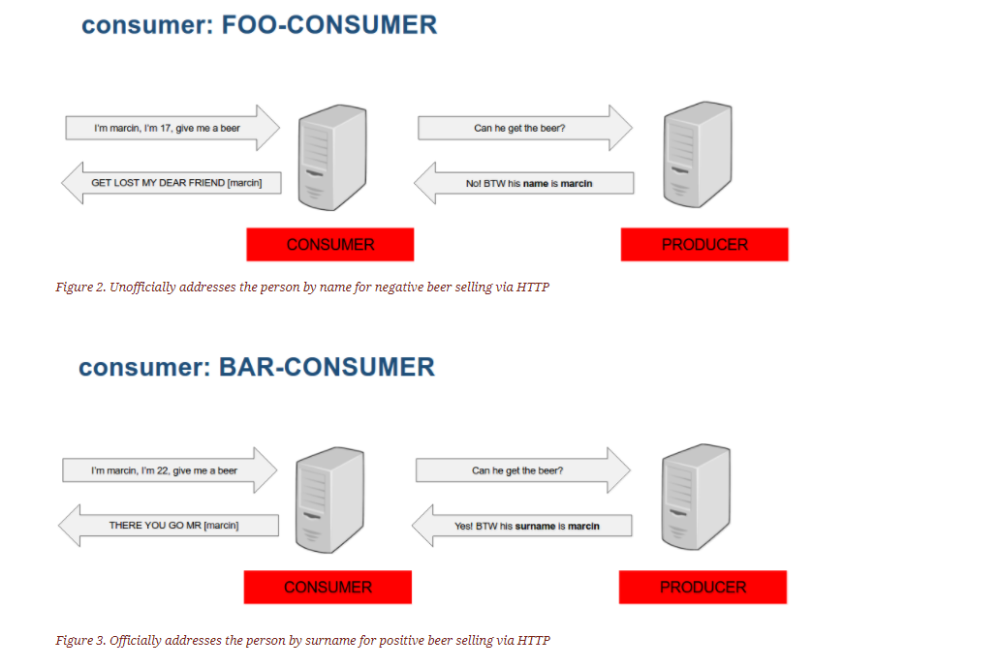

### 每个消费者都有存根
>我们将契约与生产者代码保持一致。每个消费者在专用文件夹中定义契约。对于同样的要求，消费者期望不同的响应。



- 在您的IDE中，打开consumer_with_stubs_per_consumer项目
- 消费者名称foo-service 和 消费者名称bar-service
    - 生产者，验证是否有资格获得啤酒
    - 是否给啤酒取决于 status
    - 如果这个人的姓名是 marcin，且可以获得啤酒，则说: THERE YOU GO MR [marcin]  
    否则说：GET LOST MR [marcin]

- 打开 BeerControllerTest 类,模拟foo-consumer 消费者
````java
@SpringBootTest(webEnvironment = WebEnvironment.MOCK,
		properties = {"spring.application.name=foo-consumer"});
//以某种方式命名我们的消费者
````    
- 打开BeerControllerForBarTest 类，模拟 bar-service
>现在我们要编写一个实现，但是问题是我们还不知道服务端API。  
在这里，我们涉及了消费者驱动契约的精髓。作为消费者，我们希望推动API的改变。   
这就是为什么作为消费者，推动生产者代码。

### 克隆生产者代码
- 在本教程中，我们不会克隆生产者的代码,在 IDE 打开 beer-api-producer-with-stubs-per-consumer
- 有一些生产代码写在生产者方面，但你可以完全删除它。  
CDC的想法是可以在不为该功能编写代码的情况下完成契约定义
- 在生产者端添加依赖
```xml
<dependency>
	<groupId>org.springframework.cloud</groupId>
	<artifactId>spring-cloud-starter-contract-verifier</artifactId>
	<scope>test</scope>
</dependency>
```
- foo-consumer http 契约
    - 创建一个src/test/resources/contracts/foo-consumer/rest 文件夹
    - 创建一个名为shouldGrantABeerIfOldEnough.groovy 契约
    - 使用$()或者value()是spring cloud contract 规定定义动态行为的方法。
    ````
      body(
                    age: $(regex("[2-9][0-9]")),
                    name: $(anyAlphaUnicode())
                )
    ````
    - 响应内容引用可以调用该 fromRequest()方法
    ````     
    response {
    		status 200
    		body("""
    			{
    				"status": "${value(ok())}",
    				//name 的字段内容 从请求体中获取
    				"name": "${fromRequest().body('$.name')}"
    			}
    			""")
    		headers {
    			contentType(applicationJson())
    		}
    	}
    ````
- bar-consumer HTTP契约
    - 创建一个 src/test/resources/contracts/bar-consumer/rest文件夹
    - 内容与foo-consumer http 契约相似
    - 唯一的区别是响应包含 surname字段而不是name字段
    
### 在生产者方面设置Spring Cloud Contract插件
> 我们希望为我们生成一些存根，而不需要编写一行代码。我们需要进行此转换的工具是Spring Cloud Contract插件
````xml
<plugin>
    <groupId>org.springframework.cloud</groupId>
    <artifactId>spring-cloud-contract-maven-plugin</artifactId>
    <version>${spring-cloud-contract.version}</version>
    <extensions>true</extensions>
</plugin>
````
- 调用命令在本地安装存根 ./mvnw clean install -DskipTests
>在那里，您将看到 contracts所有合同被复制的mappings文件夹和您将找到所有生成的存根的文件夹。   
默认情况下，Spring Cloud Contract使用WireMock作为假HTTP服务器的实现。在rest子文件夹下，您将看到所有生成的存根
    
### 在客户端编写缺少的实现
> 我们知道API应该是什么样子了，去BeerController编写缺少的实现
- 我们要发送POST HTTP方法http://localhost:8090/check
- 发送 Person json
- 根据响应状态返回数据
- 运行BeerControllerTest 和 BeerControllerForBarTest ，现在是失败的
- 在消费者测试中打开Stub Runner,使用本地的存根测试
    - 添加依赖
    ````xml
    <dependency>
    	<groupId>org.springframework.cloud</groupId>
    	<artifactId>spring-cloud-starter-contract-stub-runner</artifactId>
    	<scope>test</scope>
    </dependency>
    ````
    - 添加Stub Runner功能
    ````
    @AutoConfigureStubRunner(workOffline = true,
    		ids = "com.example:beer-api-producer-with-stubs-per-consumer",
    		stubsPerConsumer = true)
    		
    stubsPerConsumer 
        打开了stubsPerConsumer标志。这样做意味着存根的路径被扫描，
        只有那些包含spring.application.name 值的存根路径才被应用	
        
    如果不想设置 spring.application.name 属性，可以这样
    @AutoConfigureStubRunner(workOffline = true,
    		ids = "com.example:beer-api-producer-with-stubs-per-consumer",
    		stubsPerConsumer = true,
    		consumerName = "bar-consumer")
    		
    		
    		spring.application.name ：指定存根的文件夹
    		或
    		consumerName : 指定存根的文件夹 
        	
    ````
- BeerControllerTest 运行测试
- BeerControllerForBarTest  运行测试，另一种写法 


### 生产者进行测试 打开producer项目

- 设置Spring Cloud Contract插件，添加依赖
````xml
<plugin>
    <groupId>org.springframework.cloud</groupId>
    <artifactId>spring-cloud-contract-maven-plugin</artifactId>
    <version>${spring-cloud-contract.version}</version>
    <extensions>true</extensions>
    <configuration>
        <baseClassMappings>
            <baseClassMapping>
                <contractPackageRegex>.*rest.*</contractPackageRegex>
                <baseClassFQN>com.example.BeerRestBase</baseClassFQN>
            </baseClassMapping>
        </baseClassMappings>
    </configuration>
</plugin>
````
- 测试类以 Base 结尾
- 手动映射，测试类与契约所在目录的映射
- 生成测试 ./mvnw clean install
````
生成的测试在/generated-test-sources/contracts 下面
````
- 这时，每个消费服务文件夹下，就有对应的测试类
- request契约动态的部分已转换为具体值。response的动态部分将被转换成匹配器。


### BeerRestBase 类
- @RunWith(MockitoJUnitRunner.class)以启用Mockito
- 我们要测试，ProducerController所以我们可以创建一个字段@InjectMocks ProducerController 
- 使用TypeSafeMatcherHamcrest创建一个匹配器PersonToCheck
- 现在我们需要配置Spring Cloud Contract使用的RestAssured来发送请求
- 使用模拟和RestAssured设置 - 我们可以运行基于HTTP的自动生成测试
    
     
### 使用JUnit规则 定义 存根服务器
### 打开BeerControllerWithJUnitForBarTest 类
````
    @Rule
    public StubRunnerRule rule = new StubRunnerRule()
            .downloadStub("com.example", "beer-api-producer-with-stubs-per-consumer")//下载存根
            .workOffline(true)//离线
            .withStubPerConsumer(true)//打开每个消费者功能的存根
            .withConsumerName("bar-consumer"); //定义消费者的名字 bar-consumer
            
    //启动端口        
    @Before
    public void setupPort() {
        beerController.port = rule.findStubUrl("beer-api-producer-with-stubs-per-consumer").getPort();
    }            
````


