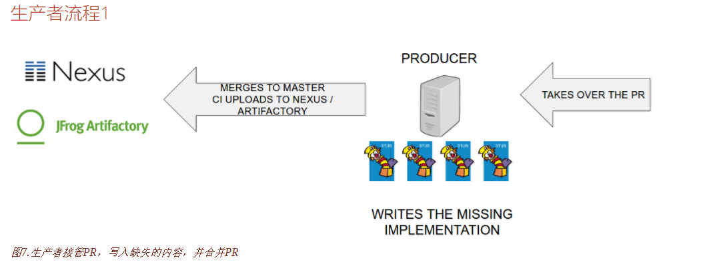
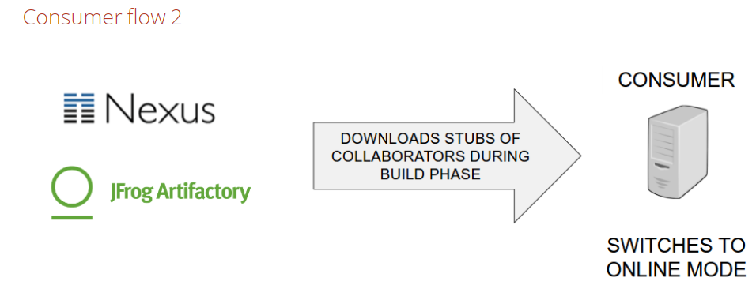

#### 学习文档
http://cloud-samples.spring.io/spring-cloud-contract-samples/workshops.html  

https://cloud.spring.io/spring-cloud-pipelines/spring-cloud-pipelines.html  

视频    
https://www.youtube.com/watch?v=IiK9A9nQ6NU

### 生产者方面的契约
- HTTP＆Messaging的简单DSL示例
- 按惯例挑选的基础班
- 从契约生成文档

##使用消费者驱动的合同就像在架构级使用TDD。我们首先在消费者端进行测试。

### 任务
>生产者方面的契约  
HTTP＆Messaging的简单DSL示例  
从契约生成文档

###克隆生产者的代码

由于我们希望IDE帮助我们完成代码，所以我们添加必要的Spring Cloud Contract依赖关系。
您需要添加spring-cloud-starter-contract-verifier为测试依赖项
```xml
<dependency>
	<groupId>org.springframework.cloud</groupId>
	<artifactId>spring-cloud-starter-contract-verifier</artifactId>
	<scope>test</scope>
</dependency>

```

###定义第一个 HTTP contract  
- 创建src/test/resources/contracts/beer/rest和 src/test/resources/contracts/beer/messaging文件夹。  
rest :http 的合同 
messaging:消息传递合同  

> 提示：为消费者创建一个文件夹是个好习惯。所以如果你的消费者应用程序名称是`foo-service`，
那么你可以创建一个`src / test / resources / contracts / foo-service / beer / rest`
和 `src / test / resources / contracts / foo-service / beer / messaging`文件夹

- 您可以使用Groovy DSL定义合同。
我们创建我们的第一个HTTP合同,在rest文件夹下创建一个文件shouldGrantABeerIfOldEnough.groovy
    - Contract.make方法开始定义合同
    - 调用description()方法来提供一些有意义的描述
        > 多行字符串""" """来转义所有特殊字符
    - 调用request { }和response { }方法
      > request body 中描述json格式 [key: "value", secondKey: 2] 或 { "age": 22, "name": "marcin" } 也可以 [age:22, name:"marcin"]  
      body([age:22, name:"marcin"])或者body(age:22, name:"marcin")  
      > response body json值定义响应体 body(""" { "status" : "OK" } """)
    
    
### 定义第一个 mq messaging contract   
我们转到src/test/resources/contracts/beer/messaging文件夹  
定义一些消息传递合同。创建一个shouldSendAcceptedVerification.groovy文件

- label  定义消费者触发该消息的标识
>HTTP通信是同步的——您发送请求并得到响应。在信息传递的情况下，消费者可能会突然收到信息。
在消费者测试中，消费者需要一个方法来触发这个消息。这个钩子被称为Spring cloud中的标签 label。
我们将标签命名为accepted_verification。要在合同中定义它，只需调用这样的label方法
 label 'accepted_verification'
 
- input 中定义合同触发的方法 
 
- outputMessage  定义我们想要输出消息的合同，在这种方法中，我们需要定义我们想要发送的内容和位置


### 在生产者方面设置Spring Cloud Contract插件
````xml
<plugin>
    <groupId>org.springframework.cloud</groupId>
    <artifactId>spring-cloud-contract-maven-plugin</artifactId>
    <version>${spring-cloud-contract.version}</version>
    <extensions>true</extensions>
</plugin>
````
- 只需调用命令在本地安装存根
$ ./mvnw clean install -DskipTests  
您可以查看target/stubs/META-INF/  或 build/stubs/META-INF/  
您将看到 contracts所有合同被复制的mappings文件夹和您将找到所有生成的存根的文件夹  
默认情况下，Spring Cloud Contract使用WireMock作为假HTTP服务器的实现。在rest子文件夹下，您将看到所有生成的存根  


### 编写缺少的消费者HTTP实现
消费者的代码-让我们回到BeerControllerTest和BeerController  
假设生产者应用程序正在运行 http://localhost:8090/，现在继续尝试编写BeerController的缺失实现

在HTTP消费者测试中打开Stub Runner ，让我们运行BeerControllerTest一次。  
它将失败，因为我们尝试向尚未启动的实例发送请求

添加Spring Cloud Starter Contract Stub Runner测试依赖
````xml
<dependency>
	<groupId>org.springframework.cloud</groupId>
	<artifactId>spring-cloud-starter-contract-stub-runner</artifactId>
	<scope>test</scope>
</dependency>
````

我们可以用我们的测试类来注释   
@AutoConfigureStubRunner(workOffline = true, ids = "com.example:beer-api-producer:+:stubs:8090")。  
这将是：  
- 它将从Maven local（workOffline=true）下载存根JAR，
- 它将搜索com.example:beer-api-producer具有最新版本（+）和stubs分类器的坐标的JAR,一旦找到假的HTTP服务器存根将在端口启动8090
- 重新运行测试 - 它应该自动通过
````
[           main] o.s.c.c.s.StubDownloaderBuilderProvider  : Will download stubs using Aether
Started stub server for project [com.example:beer-api-producer:0.0.1-SNAPSHOT:stubs] on port 8090
````
>我们可以与实际的API进行交互，而无需编写一行生产代码


### 使用HTTP契约

>TDD(Test-Driven Development) 测试驱动开发是敏捷开发中的一项核心实践和技术，也是一种设计方法论。  
TDD得原理是在开发功能代码之前，先编写单元测试用例代码，测试代码确定需要编写什么产品代码  

- Spring Cloud Contract允许您为body，urls，headers等部分提供动态值。日期，数据库ID，UUID等时特别有用  
- 打开shouldGrantABeerIfOldEnough.groovy并转到请求体age元素
- 写$(regex('[2-9][0-9]')) 而不是固定值
  - 为了告诉Spring Cloud Contract，您将需要使用动态值集$()或value()方法
  - 接下来使用regex() String的Pattern方法 return Pattern.compile("[2-9][0-9]"); 也可以 return "[0-1][0-9]";
  - 检查存根的输出,您将看到生成的映射已从JSON路径中的等式检查更改为正则表达式检查

  
###编写缺少的消费者消息传递实现
- BeerVerificationListenerTest测试类
- Spring Cloud Stream是对队列/主题的抽象
- Sink的input包含用于监听消息的输入通道，Source的output包含用于发送消息的输出通道
- 在src/main/resources/application.yml 设置spring.cloud.stream.bindings.input.destination=verifications  
  通道名为input   指定输入通道对应的主题名  output 端的输出通道对应的主题名与input 一样才行，如果不一样要通过@ServiceActivator设置
  ````
  //该接口是 sring cloud stream 中默认实现的 对输入消息通道绑定的定义
  @EnableBinding(Sink.class)
  
  @StreamListener  
  它主要定义在方法上，作用是将被修饰的方法注册为消息中间件上数据流的事件监听器。
  @StreamListener 注解使方法接受管道推送的消息
  
  @Input 注解表示绑定订阅输入管道，通过管道接受来自发布者的消息
  @output 注解表示绑定输出管道，通过管道发布消息。
  @InboundChannelAdapter 注解用来绑定输出的管道，进行消息推送
  @ServiceActivator 注解分别绑定输入和输出的管道，两个管道之间消息的传递
  
  http://blog.csdn.net/jsu_9207/article/details/72836325
  ````
- 消费者 Stream dependencies
````xml
<!-- Stream dependencies  -->
		<dependency>
			<groupId>org.springframework.cloud</groupId>
			<artifactId>spring-cloud-starter-stream-rabbit</artifactId>
		</dependency>
		<dependency>
			<groupId>org.springframework.cloud</groupId>
			<artifactId>spring-cloud-stream-test-support</artifactId>
			<scope>test</scope>
		</dependency>
````  
- 生产者 Stream dependencies   
配置:  
spring.cloud.stream.bindings.output.content-type=application/json  
spring.cloud.stream.bindings.output.destination=verifications
                                                                 
````xml
        <dependency>
			<groupId>org.springframework.cloud</groupId>
			<artifactId>spring-cloud-starter-stream-rabbit</artifactId>
		</dependency>
		<dependency>
			<groupId>org.springframework.cloud</groupId>
			<artifactId>spring-cloud-stream-test-support</artifactId>
			<scope>test</scope>
		</dependency>
````
- 让我们试着运行我们的BeerVerificationListenerTest测试

### 在mq消息 消费者测试中打开Stub Runner
- 我们需要使用Spring Cloud Contract Stub Runner来下载存根。  
  >只需添加 @AutoConfigureStubRunner(workOffline = true, ids = "com.example:beer-api-producer")  
   下载最新的存根com.example:beer-api-producer，如果JAR包含任何HTTP存根，然后在随机端口注册它们
- 现在我们需要一个解决方案来触发消息。为此，我们需要自动连接一个StubTrigger界面。 
  >只需添加@Autowired StubTrigger stubTrigger字段到您的测试
  ````java
           /**
           * 指定触发 mq存根发送消息给消费者
           */
          stubTrigger.trigger("accepted_verification");
  ````
  
### 生产流程-1 存根发布于 私服 nexus



### 设置Spring Cloud Contract plugin 
#### 项目生成测试 
>Spring Cloud契约可以从契约中生成测试，以确保实现的API与已定义的契约相兼容  
- Spring Cloud契约需要一个基类，所有生成的测试都将扩展。目前我们支持三种不同的定义基类的方法
- 用于所有测试的一个类
- 基于约定的命名 ,在测试类名称后加 Base，代表基类
- 手动映射(您可以声明匹配某些正则表达式的契约必须有一个具有完全限定名的基类)
- 在下面的例子中，我们将使用基于约定的命名
````xml
		<plugin>
				<groupId>org.springframework.cloud</groupId>
				<artifactId>spring-cloud-contract-maven-plugin</artifactId>
				<version>${spring-cloud-contract.version}</version>
				<extensions>true</extensions>
				<configuration>
				    <!--该值的传递告诉插件，在com.example下有一个给定的基类可用-->
					<packageWithBaseClasses>com.example</packageWithBaseClasses>
					
					<baseClassMappings>
						<baseClassMapping>
							<contractPackageRegex>.*intoxication.*</contractPackageRegex>
							<baseClassFQN>com.example.intoxication.BeerIntoxicationBase</baseClassFQN>
						</baseClassMapping>
					</baseClassMappings>
				</configuration>
				<dependencies>
					<dependency>
						<groupId>com.example</groupId>
						<artifactId>beer-common</artifactId>
						<version>${project.version}</version>
						<scope>compile</scope>
					</dependency>
				</dependencies>
			</plugin>
````

### 从Pull请求中更新契约
我们需要修改消息传递契约，因为它们缺少来自生产者视角的重要部分——输入部分
- 在消息传递时，必须有一些触发器，从而产生输出消息
- Spring Cloud Contract接受3种情况
    - 输入消息产生一个输出消息
    - 一个方法执行产生一个输出消息
    - 输入消息不会产生任何输出消息
- 在我们的情况下，我们将有一个方法产生一个输出,触发方法需要一个带有方法执行的字符串。因此，如果在基类中  
它将触发一个测试消息
````groovy
input {
		// the contract will be triggered by a method 该合同将触发的方法
		triggeredBy('clientIsOldEnough()')
	}
````  
- 从契约生成测试
    - /mvnw clean install
    > 如果您查看生成的测试，您会注意到，request合同部分的动态部分已转换为具体值。response侧面的任何动态位将被转换成匹配器matchers。

------
### 总结
1. 先写契约文件
2. 然后安装到本地，并生成 存根文件
3. 运行消费端，测试用例，并从存根上获取响应数据
4. 对于消费端 mq消息测试，需要在生产端 配置 maven 插件告诉mq消息触发的基类设置  

* TDD的全称是Test Driver Development，测试驱动开发。就是开发要以测试为驱动。编码之前，测试先行。
------

### 开始写 生产者端的业务代码
- 编写ProducerController 逻辑
- CDC的想法不是测试每一个特性。契约测试是为了查看API是否匹配，而不是功能是否有效。  
  这就是为什么我们不应该访问数据库等等，这意味着我们将使用PersonCheckingService的mock
- 启动 mock
````java
@RunWith(MockitoJUnitRunner.class)
public abstract class BeerRestBase {
...
}
````
- 我们将测试ProducerController，ProducerController所以我们可以创建一个字段@InjectMocks ProducerController   
  Mockito将通过构造函数为我们注入任何mock
```java
    @Mock PersonCheckingService personCheckingService;
   
    @InjectMocks ProducerController producerController;

    @Before
    public void setup() {
        given(personCheckingService.shouldGetBeer(argThat(oldEnough()))).willReturn(true);
    }
```
- 我们使用来自Hamcrest的TypeSafeMatcher来为PersonToCheck创建一个matcher。  
  在这种情况下，如果检查的人年龄较大或20岁，那么该方法应该返回true。
  > Hamcrest是一个协助编写用Java语言进行软件测试的框架。它支持创建自定义的断言匹配器（assertion matchers)  
  允许声明式定义匹配规则。[1]这些匹配器在单元测试框架（例如JUnit[2]和jMock）中有用
- 现在我们需要配置Spring Cloud Contract使用的RestAssured来发送请求。在我们的例子中，  
  设置 RestAssuredMockMvc.standaloneSetup(producerController) 即可
- 有了mock和rest设置,我们已经准备好运行基于HTTP的自动生成测试了  


## 生产者端 mq消息测试 编写
- 设置主题   
 src/main/resources/application.yml文件设置主题 spring.cloud.stream.bindings.output.destination=verifications
- 转到BeerMessagingBase测试类，添加 @AutoConfigureMessageVerifier ，这将配置与消息传递相关的设置
- 使用Spring Cloud Contract MessageVerifier 抽象（它允许从Spring Cloud Stream，Sprig Integration，Apache Camel发送和接收消息）。
- 我们可以运行测试 mvnw clean install

### 生产流程-2 存根发布于 私服 nexus
  

- 在合并PR之后，生产者的存根位于某些Artifactory / Nexus实例中
- 作为消费者，我们不再需要从本地的Maven存储库检索存根 - 我们希望从远程位置下载它们
```
@RunWith(SpringRunner.class)
@SpringBootTest(webEnvironment = WebEnvironment.MOCK)
@AutoConfigureMockMvc
@AutoConfigureJsonTesters
@AutoConfigureStubRunner(
repositoryRoot="http://foo.com/bar,
ids = "com.example:beer-api-producer:+:stubs:8090")
@DirtiesContext
public class YourTestOnTheConsumerSide extends AbstractTest {
}

repositoryRoot  属性值可以通过application.yml 获取
```

### 从契约 生成文档
>Spring Cloud Contract的另一个功能是轻松创建生产者的整个API的文档的选项


### 消费端测试


  

    
        