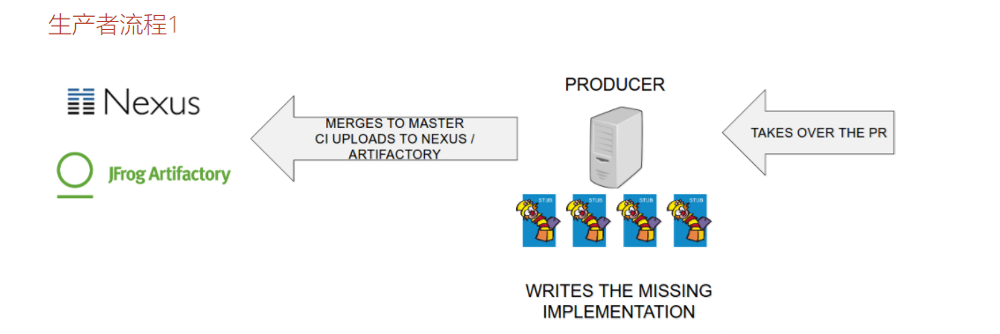

### Spring Cloud Contract背后的更高级概念。
- 使用正则表达式
- 代码执行
- 从响应引用请求
- 使用存根和测试匹配器
- 使用随机端口
- 异步通信
- 优先级

### 打开项目 beer-api-consumer
- 打开GrumpyBartenderControllerTest,第一步是写出缺少的测试实现
````
 //tag::tests[]
    @Test
    public void should_fail_to_sell_beer() throws Exception {
        //remove::start[]
        mockMvc.perform(MockMvcRequestBuilders.post("/grumpy")
                .contentType(MediaType.APPLICATION_JSON)
                .content(json.write(new Person("marcin", 22)).getJson()))
                .andExpect(status().isOk())
                .andExpect(jsonPath("$.whatTheBartenderSaid").value("You're drunk [marcin]. Go home!"))
                .andExpect(jsonPath("$.whatDoWeDo").value("Go to another bar"));
        //remove::end[]
    }

    @Test
    public void should_sell_beer_to_Josh() throws Exception {
        //remove::start[]
        mockMvc.perform(MockMvcRequestBuilders.post("/grumpy")
                .contentType(MediaType.APPLICATION_JSON)
                .content(json.write(new Person("starbuxman", 22)).getJson()))
                .andExpect(status().isOk())
                .andExpect(jsonPath("$.whatTheBartenderSaid").value("There you go Josh!"))
                .andExpect(jsonPath("$.whatDoWeDo").value("Enjoy!"));
        //remove::end[]
    }
    //end::tests[]
````

### 以上测试运行失败，打开producer_advanced项目
>现在我们来写我们的契约！您可以使用Groovy DSL定义契约。我们创建我们的第一个HTTP契约
- 在下src/test/resources/contracts/beer/rest/，创建一个 shouldNotSellAnyAlcohol.groovy文件
- 定义契约的初始化值和动态值
> stubMatchers节内，我们定义了一个匹配JSON路径的元素 $.age必须匹配正则表达式[2-9][0-9]
> 参考：https://cloud.spring.io/spring-cloud-contract/spring-cloud-contract.html#_dynamic_properties_in_matchers_sections
````groovy
Contract.make {
    description("""
Represents a grumpy waiter that is too bored to sell any alcohol for anyone.
""")
    request {
        method POST()
        url '/buy'
        body(
                name: $(anyAlphaUnicode()),
                age: 25 //初始化值
        )
        /**
         * 如果通过匹配器部分提供值，那么添加匹配项的键的值将从自动测试断言生成中删除。
         * 您必须通过匹配器部分手动提供这些值
         *
         * 提供动态匹配 age 值是否合法
         */
        stubMatchers {
            jsonPath('$.age', byRegex('[2-9][0-9]'))
        }
        headers {
            contentType(applicationJson())
        }
    }
    response {
        status 200
        body(
                /**
                 *  Spring Cloud Contract为您提供了一个名为fromRequest()的方法，
                 *  它允许您在响应中指定要从请求中获取某些值
                 */
                message: "You're drunk [${fromRequest().body('$.name')}]. Go home!",

                /**
                 * 对于生成的测试，我们希望通过基类中定义的assertStatus()方法进行自定义断言
                 *
                 * 自定义断言为了实现这一目标，
                 * 我们需要编写 $（c('NOT_OK')、 p(execute('assertStatus($it)')))
                 *
                 * c()是consumer()的快捷方式，p()是producer()的缩写。通过调用$(c()，p())，
                 * 我们为消费者提供了一个具体的值，并为生产者提供了一个动态的值。

                 $(c("NOT_OK")，...)意味着，对于stub中的响应，对于状态字段，我们希望存根包含NOT_OK的值。

                 $(...,p(execute('assertStatus($it)')))
                 意味着我们希望在生成器方面在自动生成测试中运行基类中定义的方法.该方法称为assertStatus()。
                 作为该方法的参数，我们要传递响应JSON中存在的元素的值。

                 在我们的例子中，我们为$.status字段提供一个动态值。
                 assertStatus($it)被转换为 assertStatus(从 JSON 响应读取 $.status)
                 *
                 */
                status: $(c("NOT_OK"), p(execute('assertStatus($it)')))
        )

        /**
         * 现在我们可能想message通过一种方法来对该领域进行一些更复杂的分析assertMessage()。
         * 还有另一种方法：我们可以调用该 testMatchers部分。
         *
         * 根据 testMatchers，我们可以定义，通过 JSON 的路径，我们想要动态地断言的元素
         */
        testMatchers {
            jsonPath('$.message', byCommand('assertMessage($it)'))
        }
        headers {
            contentType(applicationJson())
        }
        async()
    }
    /**
     * 我们看到一个星巴克人总是要得到啤酒。因此，我们需要一个特定的通用模式。
     * 这就是为什么我们将优先级设置为100（数字越高，优先级越低）
     */
    priority 100
}
````
- 创建一个 shouldSellAlcoholOnlyToStarbuxman.groovy文件
- 本地安装存根 ./mvnw clean install -DskipTests

- 回到消费者 GrumpyBartenderControllerTest类
    - 添加Stub Runner，希望自动设置端口
    ````java
    @AutoConfigureStubRunner(workOffline = true, ids = "com.example:beer-api-producer-advanced")  
    ````
    ````
    那么如何检索端口值呢？有两种方法：
    
    Autowire注释的字段 @Value("${stubrunner.runningstubs.artifactid.port}")。
    
    @Value("${stubrunner.runningstubs.beer-api-producer-advanced.port}") int stubPort;    
    @Before
    public void setupPort() {
        controller.port = stubPort;
    }
    
    使用自动装配StubFinder界面，其中包括该findStub方法
    @Autowired StubFinder stubFinder;
    @Before
    public void setupPort() {
        controller.port = stubFinder.findStubUrl("beer-api-producer-advanced").getPort();
    }
    ````
    
  


- 运行测试类  GrumpyBartenderControllerTest

### 生产者测试
- 设置Spring Cloud Contract插件
````
<plugin>
    <groupId>org.springframework.cloud</groupId>
    <artifactId>spring-cloud-contract-maven-plugin</artifactId>
    <version>${spring-cloud-contract.version}</version>
    <extensions>true</extensions>
    
    传递该值会告知插件，com.example包下的给定基类可用
    <configuration>
        <packageWithBaseClasses>com.example</packageWithBaseClasses>
    </configuration>
</plugin>
````
- 添加基类
- ./mvnw clean install  这些测试是由Spring Cloud Contract创建的自动生成测试
- 生成的测试失败了
- 添加缺失的方法
    - 去BeerRestBase。添加缺失assertStatus(String status)和assertMessage(String message) 方法
    - assertStatus应该断言status等于NOT_OK。
    - assertMessage应该断言message包含Go home!
    - 通过添加BuyController到独立设置类的列表中添加缺少的Rest Assured设置，如以下代码片段所示：
    ````
    RestAssuredMockMvc.standaloneSetup(..., new BuyController(), ...);
    我们希望我们的Controller使用异步servlet功能。这就是为什么我们需要它来返回Callable<Response>
    ````
- 当您再次运行构建时，您的自动生成测试仍然失败。失败的原因是我们使用异步servlet功能，
  但Rest Assured不知道。为了解决这个问题，我们需要async()在我们契约的响应方面添加该方法
  
